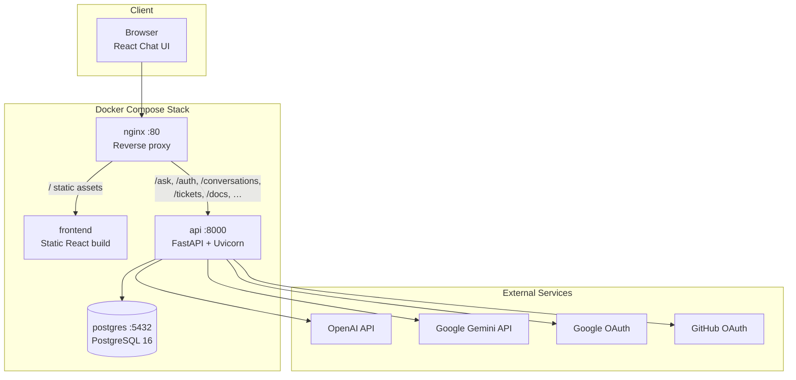
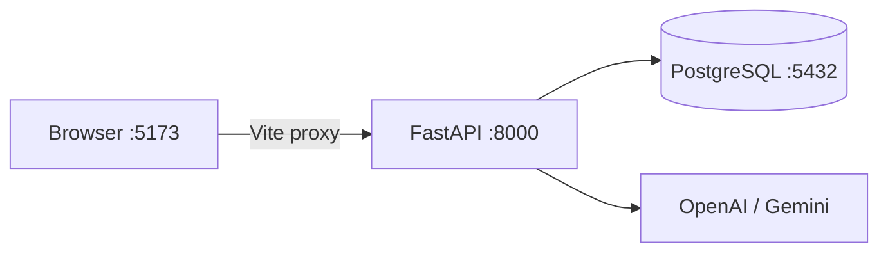
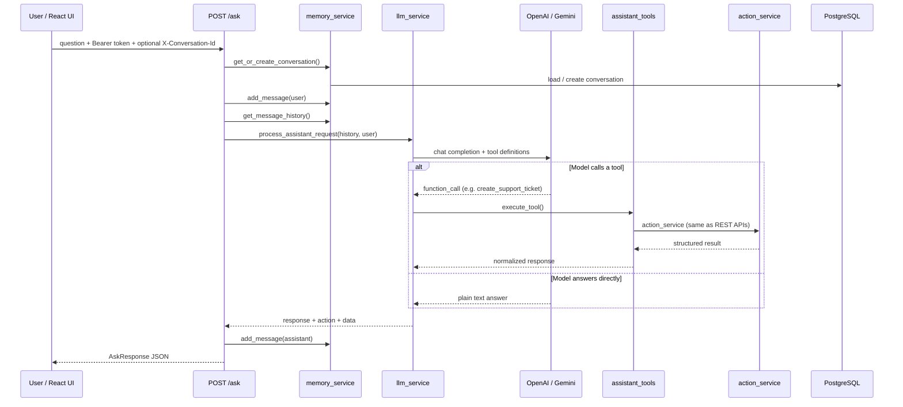
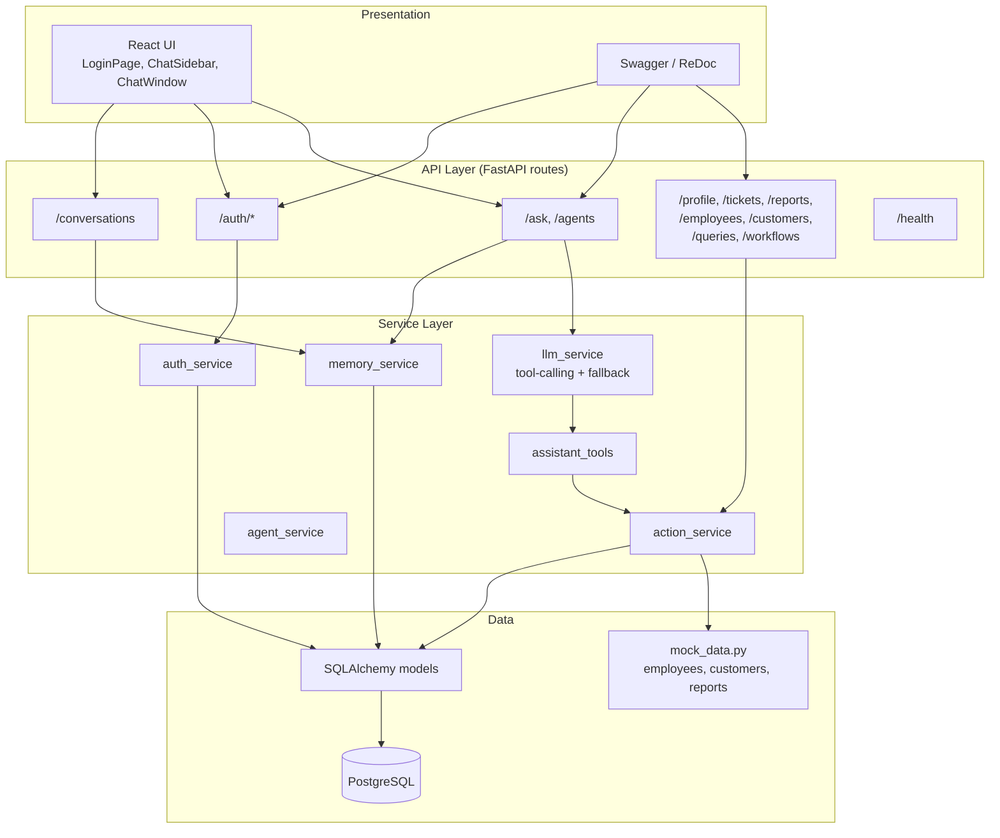

# Enterprise AI Assistant

A production-ready, full-stack enterprise assistant that answers HR, IT, and operations questions and performs business actions through a Python API and React chat UI.

Built with **Python 3.11+**, **FastAPI**, **PostgreSQL**, **React (Vite)**, **Docker**, and configurable **OpenAI** or **Google Gemini** LLM providers.

---

## Project Overview

The assistant exposes `POST /ask` as the primary chat endpoint. For each message it:

1. **Validates** the request (Pydantic guardrails on question length and content)
2. **Authenticates** the user (JWT required)
3. **Loads conversation memory** from PostgreSQL (per-user, multi-turn)
4. **Calls the LLM with tool definitions** — the model decides whether to answer directly or invoke an enterprise action
5. **Executes the chosen action** via the same service layer as the documented REST APIs (tickets, reports, lookups, queries, workflows)
6. **Returns a structured JSON response** with `action`, `data`, `conversation_id`, and optional `ticket_id`

Enterprise HR/IT data (employees, customers, reports, etc.) is served from **mock data** for demo purposes. User accounts, conversations, messages, and tickets are stored in **PostgreSQL**.

---

## Features

| Area | Capability |
|------|------------|
| **AI chat** | `POST /ask` with OpenAI or Gemini tool-calling |
| **Business actions** | Create ticket, generate report, fetch employee/customer, query DB/file, trigger workflow |
| **Tool routing** | LLM chooses tools dynamically (not keyword-based routing) |
| **Conversation memory** | PostgreSQL-backed history; sidebar UI to resume past chats |
| **Enterprise REST APIs** | Same actions exposed on Swagger under the **Enterprise** tag |
| **Authentication** | Email/password register & login, Google OAuth, GitHub OAuth, JWT + refresh tokens |
| **Provider fallback** | Auto-switches OpenAI ↔ Gemini on quota errors |
| **Input validation** | Rejects empty, whitespace-only, or >1000 character questions |
| **Error handling** | LLM failures return `action: "error"` without crashing the API |
| **Web UI** | React chat app with auth, agent selector, chat history sidebar |
| **API docs** | Swagger UI at `/docs`, ReDoc at `/redoc` |
| **Docker** | Production stack (nginx + API + frontend + PostgreSQL) and dev stack with hot reload |

---

## Architecture

### System deployment (production)



### Development deployment



In dev mode the React app runs on port **5173** and proxies API calls to the backend. Swagger is available at `http://localhost:5173/docs` (proxied) or `http://localhost:8000/docs` (direct).

---

### AI request workflow



---

### Application layers



---

### Docker services

| Service | Role |
|---------|------|
| `postgres` | PostgreSQL 16 — users, refresh tokens, conversations, messages, tickets |
| `api` | FastAPI application (Uvicorn, multi-worker in production) |
| `frontend` | React chat UI (Vite dev server in dev; static nginx build in prod) |
| `nginx` | Reverse proxy — single entry point on port 80 (production only) |

### Database migrations (Liquibase-compatible, on API startup)

Schema is **not** created by a separate Liquibase container. When the API starts, it runs migrations from `db/changelog/` before serving requests:

| Changeset | Purpose |
|-----------|---------|
| `001-initial-schema.sql` | All tables: `employees`, `users`, `refresh_tokens`, `tickets`, `conversations`, `messages` |
| `003-seed-org-hierarchy.sql` | Seeds 100 employees with org hierarchy |

Tracking uses standard Liquibase tables: `databasechangelog` and `databasechangeloglock`.

To reset and re-apply from scratch:

```bash
make docker-reset-db
make docker-dev
```

To regenerate the 100-employee seed:

```bash
python3 scripts/generate_org_seed.py
```

---

## Evolution from basic implementation

| Basic version | Current implementation |
|---------------|------------------------|
| Keyword / regex intent routing | **LLM tool-calling** — model picks the right enterprise action |
| JSON file conversation storage | **PostgreSQL** with per-user conversations and messages |
| Single `POST /ask` only | **Full Enterprise REST API** on Swagger; chat tools call the same handlers |
| One LLM provider | **OpenAI + Gemini** with UI agent selector and quota fallback |
| Unauthenticated API | **JWT auth** + Google/GitHub OAuth; chat history scoped per user |
| Plain text responses | Structured `action`, `data`, `ticket_id`, `status`, `agent` fields |

---

## Project Structure

```
enterprise-ai-assistant/
│
├── app/
│   ├── main.py                     # FastAPI app factory, CORS, validation handler
│   ├── core/
│   │   ├── config.py               # Environment & system prompt
│   │   ├── logging.py
│   │   └── security.py             # JWT helpers
│   ├── api/
│   │   ├── router.py               # Route aggregation
│   │   ├── dependencies.py         # get_current_user
│   │   └── routes/
│   │       ├── ask.py              # POST /ask, GET /agents
│   │       ├── auth.py             # Register, login, OAuth, refresh
│   │       ├── conversations.py    # Chat history list & detail
│   │       ├── enterprise.py       # Tickets, reports, lookups, queries, workflows
│   │       └── health.py
│   ├── db/
│   │   ├── models.py               # User, Conversation, Message, Ticket, …
│   │   └── session.py              # SQLAlchemy engine & sessions
│   ├── models/
│   │   ├── schemas.py              # AskRequest, AskResponse, auth schemas
│   │   ├── enterprise_schemas.py
│   │   └── openapi.py              # Swagger metadata & tags
│   ├── services/
│   │   ├── llm_service.py          # OpenAI / Gemini + tool-calling + fallback
│   │   ├── assistant_tools.py      # Tool definitions & execution
│   │   ├── action_service.py       # Enterprise business logic (mock data)
│   │   ├── memory_service.py       # Conversation persistence
│   │   ├── auth_service.py
│   │   ├── agent_service.py        # Provider health & selection
│   │   └── ticket_service.py
│   └── data/
│       └── mock_data.py            # Simulated employees, customers, reports, …
│
├── frontend/                       # React + TypeScript + Vite
│   └── src/
│       ├── App.tsx                 # Chat shell, sidebar, welcome banner
│       ├── api/client.ts           # API client with auth refresh
│       ├── components/             # ChatWindow, ChatSidebar, Header, …
│       ├── context/AuthContext.tsx
│       └── pages/                  # LoginPage, AuthCallbackPage
│
├── docker/
│   ├── api/                        # API Dockerfile & entrypoint
│   ├── frontend/                   # Frontend production Dockerfile
│   ├── nginx/nginx.conf            # Reverse proxy rules
│   └── postgres/init.sql           # Database schema
│
├── main.py                         # Uvicorn entry point
├── docker-compose.yml              # Production stack
├── docker-compose.dev.yml          # Development stack (hot reload)
├── Makefile
├── requirements.txt
└── .env.example
```

---

## API Reference

### Assistant

| Method | Path | Auth | Description |
|--------|------|------|-------------|
| `POST` | `/ask` | Bearer | Send a message; LLM routes to tools or direct answer |
| `GET` | `/agents` | No | List configured LLM providers and health |
| `GET` | `/conversations` | Bearer | List user's chat history (newest first) |
| `GET` | `/conversations/{id}` | Bearer | Load full message history for one chat |

### Enterprise (also invoked by AI tools)

| Method | Path | Description |
|--------|------|-------------|
| `GET` | `/profile` | Signed-in user profile |
| `POST` | `/tickets` | Create support ticket |
| `POST` | `/reports/generate` | Generate HR / sales / IT / leave report |
| `GET` | `/reports/types` | List available report types |
| `GET` | `/employees` | List employees |
| `GET` | `/employees/{id}` | Get employee by ID |
| `GET` | `/customers` | List customers |
| `GET` | `/customers/{id}` | Get customer by ID |
| `POST` | `/queries` | Query mock database table or CSV file |
| `GET` | `/workflows` | List workflows |
| `POST` | `/workflows/trigger` | Trigger a workflow |

### Auth

| Method | Path | Description |
|--------|------|-------------|
| `POST` | `/auth/register` | Create account |
| `POST` | `/auth/login` | Email/password login |
| `POST` | `/auth/refresh` | Refresh access token |
| `POST` | `/auth/logout` | Revoke refresh token |
| `GET` | `/auth/me` | Current user profile |
| `GET` | `/auth/google/login` | Start Google OAuth |
| `GET` | `/auth/github/login` | Start GitHub OAuth |

Interactive documentation: **Swagger** at `/docs` · **ReDoc** at `/redoc`

---

## Quick Start

### Docker (recommended)

```bash
cp .env.example .env
# Add OPENAI_API_KEY and/or GEMINI_API_KEY, set JWT_SECRET_KEY for production

# Development (hot reload)
make docker-dev

# Production
make docker-up
```

| Mode | Chat UI | Swagger |
|------|---------|---------|
| **Dev** | http://localhost:5173 | http://localhost:5173/docs or http://localhost:8000/docs |
| **Prod** | http://localhost | http://localhost/docs |

### Local (without Docker)

**Prerequisites:** Python 3.11+, Node 20+, PostgreSQL running locally

```bash
# API
python3 -m venv .venv && source .venv/bin/activate
pip install -r requirements.txt
cp .env.example .env
make dev

# Frontend (separate terminal)
make frontend-install
make frontend-dev
```

---

## Environment Variables

| Variable | Required | Default | Description |
|----------|----------|---------|-------------|
| `OPENAI_API_KEY` | If using OpenAI | — | OpenAI API key |
| `GEMINI_API_KEY` | If using Gemini | — | Google Gemini API key |
| `LLM_PROVIDER` | No | `openai` | Default provider: `openai` or `gemini` |
| `OPENAI_MODEL` | No | `gpt-4o-mini` | OpenAI model |
| `GEMINI_MODEL` | No | `gemini-2.5-flash` | Gemini model |
| `DATABASE_URL` | No | built from `POSTGRES_*` | PostgreSQL connection string |
| `JWT_SECRET_KEY` | Yes (prod) | — | Secret for signing JWTs |
| `JWT_ACCESS_TOKEN_EXPIRE_MINUTES` | No | `30` | Access token lifetime |
| `JWT_REFRESH_TOKEN_EXPIRE_DAYS` | No | `7` | Refresh token lifetime |
| `GOOGLE_CLIENT_ID` / `GOOGLE_CLIENT_SECRET` | For Google login | — | Google OAuth credentials |
| `GITHUB_CLIENT_ID` / `GITHUB_CLIENT_SECRET` | For GitHub login | — | GitHub OAuth credentials |
| `FRONTEND_URL` | No | `http://localhost:5173` | Frontend URL for OAuth redirects |
| `BACKEND_URL` | No | `http://localhost:8000` | Backend URL for OAuth callbacks |
| `CORS_ORIGINS` | No | localhost origins | Allowed CORS origins (comma-separated) |
| `APP_WORKERS` | No | `2` | Uvicorn workers (production) |
| `LOG_LEVEL` | No | `INFO` | Logging level |
| `NGINX_PORT` | No | `80` | Host port for nginx (production) |
| `API_PORT` | No | `8000` | Host port for API (dev) |
| `FRONTEND_PORT` | No | `5173` | Host port for Vite (dev) |

---

## API Examples

### Register and ask a question

```bash
# Register
curl -s -X POST http://localhost:8000/auth/register \
  -H "Content-Type: application/json" \
  -d '{"email":"demo@company.com","password":"securepass123","full_name":"Demo User"}'

# Login (or use access_token from register response)
TOKEN=$(curl -s -X POST http://localhost:8000/auth/login \
  -H "Content-Type: application/json" \
  -d '{"email":"demo@company.com","password":"securepass123"}' \
  | jq -r '.access_token')

# Ask the assistant
curl -s -X POST http://localhost:8000/ask \
  -H "Content-Type: application/json" \
  -H "Authorization: Bearer $TOKEN" \
  -d '{"question": "Generate an HR headcount report for this quarter."}'
```

### Continue a conversation

```bash
curl -s -X POST http://localhost:8000/ask \
  -H "Content-Type: application/json" \
  -H "Authorization: Bearer $TOKEN" \
  -H "X-Conversation-Id: <conversation_id_from_previous_response>" \
  -d '{"question": "Can you also create a high-priority ticket for my broken laptop?"}'
```

### List chat history

```bash
curl -s http://localhost:8000/conversations \
  -H "Authorization: Bearer $TOKEN"
```

---

## Sample Responses

### Direct AI answer

```json
{
  "response": "Our leave policy typically includes paid annual leave, sick leave, and company holidays...",
  "action": "ai_response",
  "ticket_id": null,
  "conversation_id": "a1b2c3d4-e5f6-7890-abcd-ef1234567890",
  "status": null,
  "agent": "gemini",
  "data": null
}
```

### Tool action — ticket created

```json
{
  "response": "Support ticket INC-1001 has been created for your laptop issue.",
  "action": "create_ticket",
  "ticket_id": "INC-1001",
  "conversation_id": "b2c3d4e5-f6a7-8901-bcde-f12345678901",
  "status": "Open",
  "agent": "gemini",
  "data": { "ticket_id": "INC-1001", "priority": "High", "status": "Open" }
}
```

---

## Makefile Commands

```bash
make help             # List all commands
make dev              # Run API locally with hot reload
make frontend-dev     # Run React dev server
make docker-dev       # Full dev stack in Docker
make docker-up        # Production stack
make docker-down      # Stop containers
make docker-logs      # Tail logs
make health           # Ping /health endpoint
```

---

## License

MIT
